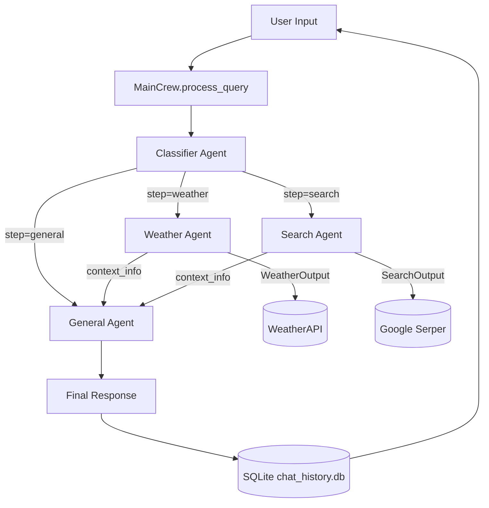
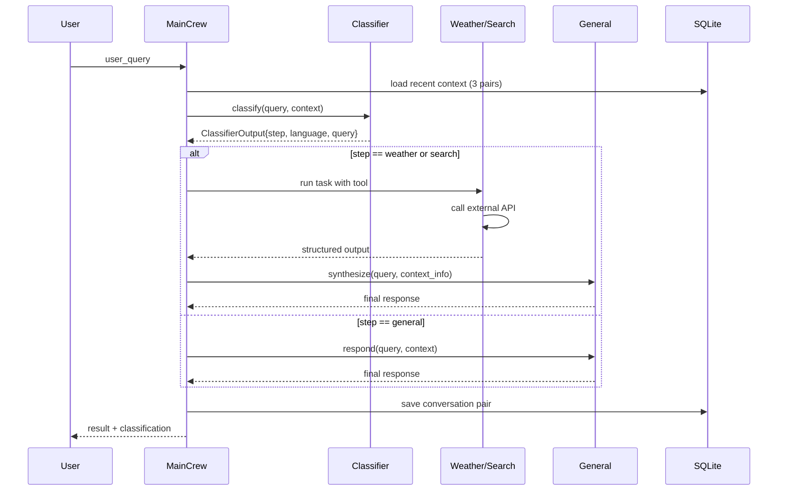
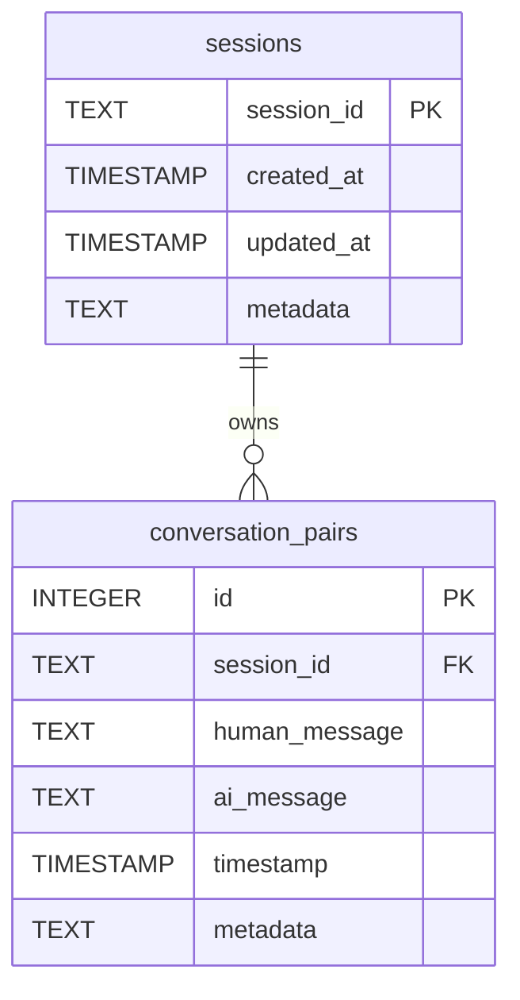

# Crew Multi-Agent System

A context-aware multi-agent conversational framework built on CrewAI that routes user queries through a classification pipeline to specialized agents for weather retrieval, web search, and general dialogue, with persistent SQLite-backed session memory.

---

## Table of Contents

1. [Introduction](#1-introduction)
2. [System Architecture](#2-system-architecture)
3. [Repository Structure](#3-repository-structure)
4. [Prerequisites](#4-prerequisites)
5. [Installation](#5-installation)
6. [Configuration](#6-configuration)
7. [Usage](#7-usage)
8. [Agent Specifications](#8-agent-specifications)
9. [Data Models](#9-data-models)
10. [Database Schema](#10-database-schema)
11. [Extending the System](#11-extending-the-system)
12. [Troubleshooting](#12-troubleshooting)
13. [Limitations and Future Work](#13-limitations-and-future-work)
14. [License](#14-license)

---

## 1. Introduction

The Crew Multi-Agent System is a Python application that demonstrates a routed multi-agent orchestration pattern using the CrewAI framework. Rather than dispatching every user query to a single large language model, the system first classifies each query by intent, then forwards it to a specialized agent equipped with the appropriate tools and prompts. This separation of concerns yields more accurate tool invocations, lower token consumption on irrelevant branches, and clearer observability of decision flow.

The system supports three concrete query classes out of the box: weather lookups (powered by the WeatherAPI service), web search (powered by Google Serper), and general conversational dialogue. A classifier agent inspects each incoming query alongside the recent conversation context, emits a structured routing decision, and a dispatcher in the `MainCrew` coordinator invokes the matching agent. When a specialized agent has completed its work, the result is passed back through the general agent so that the final response is rendered in natural, context-aware language rather than raw JSON.

Conversation memory is persisted in a local SQLite database, organized as ordered pairs of human and AI messages keyed by a session identifier. This design supports multi-turn conversations, cross-session inspection, and full session export for audit or debugging. The system is intentionally lightweight: it has no web server, no external message queue, and no container runtime requirement. It runs as an interactive command-line loop, making it suitable as a reference implementation, a teaching scaffold, or a starting point for a more elaborate production deployment.

---

## 2. System Architecture

The system follows a hub-and-spoke orchestration pattern. A single coordinator (`MainCrew`) owns the lifecycle of all agents and tasks. Each user query passes through a mandatory classification stage before being routed to a specialized worker agent. The output of a worker agent is then post-processed by the general agent to produce the final user-facing response. This two-stage design separates the concerns of fact retrieval (executed by tool-equipped specialists) and natural language synthesis (executed by the general agent with full conversation context).



### 2.1 Request Lifecycle

The following sequence diagram illustrates the message flow for a single user query, from input through persistence. Note that for `weather` and `search` routes, the general agent is invoked twice conceptually: once as the final synthesizer of the tool output. For the `general` route, the general agent is the only worker invoked.



### 2.2 Crew Composition

Each agent runs inside its own `Crew` instance with `Process.sequential`. The application does not use a single shared crew; instead, `MainCrew` constructs a fresh one-agent, one-task crew per stage. This keeps the CrewAI context window small and makes each step independently observable in logs. The trade-off is a small per-query overhead from crew instantiation, which is acceptable for an interactive CLI workload.

---

## 3. Repository Structure

The repository follows a layered architecture with clear separation between configuration, agents, tasks, tools, data models, and persistence. The top-level entry point is intentionally thin; all orchestration logic lives inside `src/crew/main_crew.py`.

```
Crew-Multi-Agents-System/
├── main.py                      # CLI entry point and command loop
├── pyproject.toml               # Project metadata and dependencies
├── env-style.txt                # Template for the .env file
├── README.md                    # This document
├── config/
│   ├── __init__.py
│   └── settings.py              # Centralized settings, env loading, validation
└── src/
    ├── __init__.py
    ├── agents/
    │   ├── __init__.py
    │   ├── classifier_agent.py  # Intent + language classifier
    │   ├── weather_agent.py     # City extraction + weather fetch
    │   ├── search_agent.py      # Query keyword extraction + web search
    │   └── general_agent.py     # Conversational synthesizer
    ├── tasks/
    │   ├── __init__.py
    │   └── task_definitions.py  # Task factory functions
    ├── tools/
    │   ├── __init__.py
    │   ├── weather_tool.py      # CrewAI BaseTool wrapping WeatherAPI
    │   └── search_tool.py       # CrewAI BaseTool wrapping Google Serper
    ├── models/
    │   ├── __init__.py
    │   └── schemas.py           # Pydantic output models
    ├── crew/
    │   ├── __init__.py
    │   └── main_crew.py         # MainCrew orchestrator
    └── database/
        ├── __init__.py
        ├── sqlite_client.py     # SQLiteClient singleton
        └── migrations.py        # Standalone schema bootstrap script
```

### 3.1 Module Responsibilities

| Module | Responsibility |
|---|---|
| `config/settings.py` | Loads environment variables, exposes a `Settings` class with defaults, validates required API keys on startup. |
| `src/agents/*` | Wraps CrewAI `Agent` construction with role, goal, backstory, LLM, and tool binding. Each class exposes `get_agent()` returning the configured `Agent`. |
| `src/tasks/task_definitions.py` | Factory functions that build `Task` objects with templated descriptions and Pydantic `output_pydantic` contracts. |
| `src/tools/*` | Subclasses of `crewai.tools.BaseTool` implementing `_run` and `_arun` for external API calls. |
| `src/models/schemas.py` | Pydantic `BaseModel` classes that enforce the structured outputs returned by each agent. |
| `src/crew/main_crew.py` | The `MainCrew` class: owns agents, builds per-stage crews, routes queries, formats context, persists results. |
| `src/database/sqlite_client.py` | Singleton SQLite client managing the `sessions` and `conversation_pairs` tables, plus trimming and export logic. |
| `main.py` | Interactive REPL with slash commands for history, stats, context, export, and session management. |

---

## 4. Prerequisites

The application has been tested against the following baseline. Earlier versions may work but are not supported.

- **Python**: 3.11.9 or newer (enforced via `requires-python` in `pyproject.toml`).
- **Operating system**: Linux, macOS, or Windows. The SQLite path uses forward slashes and is created on demand.
- **CrewAI**: 1.15.1 or newer, including the `litellm` extra required for the NVIDIA NIM endpoint.
- **Network access**: Outbound HTTPS to `integrate.api.nvidia.com`, `api.weatherapi.com`, and `google.serper.dev`.

### 4.1 Required API Keys

Three external API keys are mandatory. The application will refuse to start if any of them is missing.

| Key | Provider | Purpose | Where to obtain |
|---|---|---|---|
| `NVIDIA_API_KEY` | NVIDIA NIM | Backs the LLM used by all four agents | NVIDIA developer console |
| `WEATHER_API_KEY` | WeatherAPI | Current weather lookups | weatherapi.com |
| `SERPER_API_KEY` | Serper.dev | Google web search results | serper.dev |

---

## 5. Installation

The recommended installation path uses `uv` for fast dependency resolution, but standard `pip` against a virtual environment works equally well.

### 5.1 Clone

```bash
git clone https://github.com/armanjscript/Crew-Multi-Agents-System.git
cd Crew-Multi-Agents-System
```

### 5.2 Create a virtual environment

```bash
python3.11 -m venv .venv
source .venv/bin/activate    # Linux / macOS
# .venv\Scripts\activate     # Windows
```

### 5.3 Install dependencies

Using `uv`:

```bash
pip install uv
uv sync
```

Using `pip` directly:

```bash
pip install -e .
```

This installs CrewAI (with the `litellm` extra), LangChain, `langchain-openai`, Pydantic v2, `python-dotenv`, and `requests`, as declared in `pyproject.toml`.

### 5.4 Configure environment

Copy the template and fill in your API keys:

```bash
cp env-style.txt .env
```

Edit `.env` and replace the empty string values for `NVIDIA_API_KEY`, `WEATHER_API_KEY`, and `SERPER_API_KEY`. The remaining variables have working defaults but may be customized.

### 5.5 Initialize the database

The SQLite schema is created automatically on first run by the `SQLiteClient` constructor. To create it explicitly without starting the CLI (for example, in a deployment script), run the migration entry point:

```bash
python -m src.database.migrations
```

---

## 6. Configuration

All runtime configuration is centralized in `config/settings.py` and loaded from the `.env` file via `python-dotenv`. The `Settings` class exposes both environment-driven values and a small number of compile-time constants.

### 6.1 Environment Variables

| Variable | Required | Default | Description |
|---|---|---|---|
| `NVIDIA_API_KEY` | Yes | — | API key for the NVIDIA NIM endpoint that serves the GLM model. |
| `NVIDIA_BASE_URL` | No | `https://integrate.api.nvidia.com/v1` | Base URL for the NIM endpoint. Override only if using a self-hosted NIM deployment. |
| `WEATHER_API_KEY` | Yes | — | API key for WeatherAPI current conditions endpoint. |
| `SERPER_API_KEY` | Yes | — | API key for the Google Serper search endpoint. |
| `DATABASE_PATH` | No | `data/chat_history.db` | Filesystem path to the SQLite database. The parent directory is created on startup. |
| `NVIDIA_NIM_API_KEY` | Recommended | — | CrewAI's LLM layer inspects this variable. Setting it to the same value as `NVIDIA_API_KEY` avoids silent fallbacks. |
| `OPENAI_API_KEY` | Recommended | — | CrewAI may default to this variable. Set to any non-empty string to prevent initialization errors, even if OpenAI is not used. |
| `CREWAI_TRACING_ENABLED` | No | `false` | Disables CrewAI OpenTelemetry tracing. |
| `OTEL_SDK_DISABLED` | No | `true` | Disables the OpenTelemetry SDK entirely. |

### 6.2 Compile-Time Constants

The following attributes on the `Settings` class are not loaded from the environment and can only be changed by editing `config/settings.py`.

| Constant | Default | Description |
|---|---|---|
| `NVIDIA_MODEL` | `nvidia_nim/z-ai/glm-5.2` | The model identifier passed to the NIM endpoint. Change this to target a different GLM variant or another hosted model. |
| `WEATHER_API_URL` | `http://api.weatherapi.com/v1/current.json` | The WeatherAPI endpoint for current conditions. |
| `MAX_HISTORY_MESSAGES` | `100` | Maximum number of conversation pairs retained per session. Older pairs are pruned automatically. |
| `CONTEXT_MESSAGES` | `3` | Number of recent conversation pairs injected into classifier and general agent prompts as context. |

### 6.3 Validation

On startup, `main.py` calls `settings.validate_settings()`, which raises a `ValueError` listing every missing required key. This fail-fast behavior prevents opaque errors later in the request lifecycle. The validator also creates the database parent directory if it does not exist.

---

## 7. Usage

The application is launched as a module from the repository root:

```bash
python main.py
```

### 7.1 Session Bootstrap

On startup the user is prompted for an optional session identifier. Pressing Enter generates a fresh UUID4-based session. Providing an existing session identifier resumes that conversation, restoring access to its prior context. All subsequent messages, including slash commands, operate against the active session.

### 7.2 Interactive Commands

The REPL recognizes the following slash commands in addition to free-text queries.

| Command | Action |
|---|---|
| `/help` | Print the command list. |
| `/history` | Display all conversation pairs for the current session, including timestamps and metadata. |
| `/stats` | Print session statistics: total pair count, first and last message times, creation and update timestamps. |
| `/context` | Print the recent conversation context string that would be injected into agent prompts. |
| `/clear` | Delete all conversation pairs for the current session while preserving the session row. |
| `/new` | Start a new session. The previous session remains in the database and can be resumed later by its identifier. |
| `/delete` | Delete the current session and all of its conversation pairs, then start a fresh session. |
| `/export` | Write the current session (statistics plus all conversation pairs) to `session_export_<id>.json` in the working directory. |
| `exit` or `quit` | Terminate the program. |

### 7.3 Example Session

The following transcript illustrates a typical interaction. Inputs are shown after the `You:` prompt; system output follows. Ellipses denote truncated agent logs.

```
Enter session ID (press Enter for new session):
Session ID: 8b1f3a2e-4c5d-4a8b-9e7f-1a2b3c4d5e6f

Multi-Agent System Initialized
==================================================

You: What is the weather in Tehran?
Processing your query...

Classification Result:
{
  "step": "weather",
  "language": "English",
  "user_original_query": "What is the weather in Tehran?"
}

Response:
The current temperature in Tehran is 31°C with clear skies. Humidity is
at 18% and wind speed is approximately 12 km/h.

You: Now search for the latest news about Tehran
Processing your query...

Classification Result:
{
  "step": "search",
  "language": "English",
  "user_original_query": "Now search for the latest news about Tehran"
}

Response:
Here are the top search results for "Tehran latest news":
1. ...
2. ...

You: /stats

Session Statistics:
--------------------------------------------------
Session ID: 8b1f3a2e-4c5d-4a8b-9e7f-1a2b3c4d5e6f
Total Conversation Pairs: 2
Started: 2025-01-15T10:32:14.021543
Last Message: 2025-01-15T10:33:47.189204
--------------------------------------------------
```

### 7.4 Programmatic Usage

The `MainCrew` class can be imported and driven from custom code, bypassing the CLI entirely. This is the intended integration point for embedding the system into a larger application.

```python
from src.crew.main_crew import MainCrew

crew = MainCrew()                      # new UUID session
result = crew.process_query("Weather in Tokyo")
print(result["classification"])        # ClassifierOutput dict
print(result["result"])                # final synthesized response

# Inspect persisted state
pairs = crew.get_conversation_pairs()
stats = crew.get_session_stats()
crew.export_session()                  # writes session_export_<id>.json
```

---

## 8. Agent Specifications

Each agent is a thin wrapper around a CrewAI `Agent` instance. The wrapper binds an LLM (always the NVIDIA NIM GLM model in the default configuration), optionally attaches tools, and exposes a `get_agent()` accessor. The behavioral contract of each agent is defined by its role, goal, backstory, and the task description supplied at runtime.

### 8.1 Classifier Agent

- **Class**: `src.agents.classifier_agent.ClassifierAgent`
- **Role**: Query Classifier with Context
- **Goal**: Classify user queries considering chat history context.
- **Tools**: none.
- **Backstory**: An expert at intent classification who analyzes the user's question and the surrounding conversation context to decide among `weather`, `search`, and `general`. Also identifies the query language and preserves the original text.
- **Output contract**: `ClassifierOutput` with fields `step` (literal enum), `language` (string), and `user_original_query` (string).
- **Special behavior**: Receives the session identifier at construction time so that its task description can include the most recent `CONTEXT_MESSAGES` pairs as conversational context. This allows the classifier to disambiguate pronoun-heavy follow-up queries such as "and the weather there?".

### 8.2 Weather Agent

- **Class**: `src.agents.weather_agent.WeatherAgent`
- **Role**: Weather Specialist
- **Goal**: Extract city names and provide weather information.
- **Tools**: `WeatherTool` (wraps `http://api.weatherapi.com/v1/current.json`).
- **Backstory**: A weather specialist who identifies location names in user queries and fetches current conditions, with explicit instructions never to fabricate data.
- **Output contract**: `WeatherOutput` with fields `city` (string) and `weather_data` (optional dict containing the raw WeatherAPI response).

### 8.3 Search Agent

- **Class**: `src.agents.search_agent.SearchAgent`
- **Role**: Search Specialist
- **Goal**: Transform queries into search-friendly keywords.
- **Tools**: `SerperSearchTool` (wraps `https://google.serper.dev/search`).
- **Backstory**: An expert at query refinement who extracts at most three to four keywords from the user's original phrasing to maximize search relevance.
- **Output contract**: `SearchOutput` with fields `transformed_query` (string) and `search_results` (optional list of organic result dicts from Serper).

### 8.4 General Agent

- **Class**: `src.agents.general_agent.GeneralAgent`
- **Role**: General Assistant with Context
- **Goal**: Handle general queries with context from chat history.
- **Tools**: none. Receives context info as a string injected into the task description.
- **Backstory**: A helpful assistant that uses the last three messages of chat history to produce contextual responses, greets users in their own language, admits ignorance honestly, and maintains conversation flow.
- **Output contract**: `GeneralOutput` with a single `response` field.
- **Special behavior**: This agent is invoked as the final synthesis stage for `weather` and `search` routes. The structured output of the specialist agent is formatted into a human-readable `context_info` string and passed into the general agent's task description, so the final response combines retrieved facts with conversational tone.

---

## 9. Data Models

All agent outputs are constrained by Pydantic v2 models defined in `src/models/schemas.py`. CrewAI uses the `output_pydantic` parameter on each `Task` to enforce these contracts; the LLM is prompted to emit JSON conforming to the schema, and `model_validate_json` parses and validates the result.

```python
class ClassifierOutput(BaseModel):
    step: Literal["weather", "search", "general"]
    language: str
    user_original_query: str

class WeatherOutput(BaseModel):
    city: str
    weather_data: Optional[Dict[str, Any]] = None

class SearchOutput(BaseModel):
    transformed_query: str
    search_results: Optional[List[Dict[str, Any]]] = None

class GeneralOutput(BaseModel):
    response: str
```

Two additional models, `ConversationPair` and `ChatHistory`, are defined for in-memory representation of persisted state. They are not currently attached to any task but are used as serialization helpers by the export pipeline.

The strict typing of `step` as a `Literal` enum means a malformed LLM response that emits, for example, `"Weather"` (capitalized) or `"forecast"` will raise a `ValidationError`. The `MainCrew.process_query` method catches this and falls back to a `general` classification with `language="unknown"`, ensuring the system degrades gracefully rather than crashing on a single bad LLM output.

---

## 10. Database Schema

Persistence is handled by a single SQLite file, defaulting to `data/chat_history.db`. The schema consists of two tables and two indexes, created idempotently by `SQLiteClient._init_database` and by the standalone `src/database/migrations.py` script.

### 10.1 Entity Relationship



### 10.2 Indexes

- `idx_conversation_session_timestamp` on `(session_id, timestamp DESC)` accelerates the common query "most recent N pairs for this session".
- `idx_conversation_session` on `(session_id)` accelerates count and trim operations.

### 10.3 Operational Behavior

- **Insertion**: Each completed query produces one row in `conversation_pairs`. The session row is upserted on first reference via `INSERT OR IGNORE`. The session's `updated_at` column is refreshed on every insertion.
- **Trimming**: After each insertion, `_trim_conversation_pairs` counts the session's pairs. If the count exceeds `MAX_HISTORY_MESSAGES` (default 100), the oldest pairs beyond the limit are deleted. This caps unbounded growth in long-running sessions.
- **Context retrieval**: `get_recent_context` returns a formatted string of the most recent `CONTEXT_MESSAGES` pairs (default 3), used to seed the classifier and general agent prompts.
- **Cascade deletion**: The foreign key on `conversation_pairs.session_id` declares `ON DELETE CASCADE`. Note that SQLite does not enforce foreign keys unless `PRAGMA foreign_keys = ON` is set per connection; the current client does not set this pragma, so cascades are not enforced at the database level. The application compensates by issuing explicit `DELETE FROM conversation_pairs WHERE session_id = ?` before deleting the session row.
- **Export and import**: `export_session` returns a JSON-serializable dict combining session statistics and all conversation pairs. `import_session` clears any existing pairs for the target session and re-inserts the provided pairs verbatim, preserving original timestamps.

---

## 11. Extending the System

The architecture is intentionally uniform: adding a new capability follows the same five-step recipe used by the existing weather and search capabilities. This section documents that recipe so that contributors can extend the system without modifying the core orchestrator.

### 11.1 Adding a New Specialized Agent

1. **Define a Pydantic output model** in `src/models/schemas.py`. The model should capture any structured data the agent will return.
2. **Implement a tool** (if external data is required) under `src/tools/`. Subclass `crewai.tools.BaseTool`, set `name` and `description`, and implement `_run` (and optionally `_arun`).
3. **Implement the agent wrapper** under `src/agents/`. Bind the LLM, attach the tool, and expose `get_agent()`.
4. **Add a task factory** in `src/tasks/task_definitions.py` following the existing `create_*_task` pattern. Be sure to set `output_pydantic` to the new schema.
5. **Wire the route** in `MainCrew.process_query`. Extend the `Literal` enum in `ClassifierOutput` with the new step name, add an `elif` branch that calls a new `_handle_<step>` method, and decide whether the output should flow through the general agent for final synthesis.

### 11.2 Swapping the LLM Provider

All agents construct their `LLM` instance from the same three settings: `NVIDIA_BASE_URL`, `NVIDIA_API_KEY`, and `NVIDIA_MODEL`. To switch providers, either edit these settings centrally in `config/settings.py`, or override the `LLM` construction in each agent class. For OpenAI-compatible providers, only the base URL, API key, and model identifier need to change. CrewAI's `litellm` integration accepts any OpenAI-compatible endpoint.

### 11.3 Replacing SQLite

The persistence layer is accessed exclusively through the `sqlite_client` singleton. Replacing SQLite with another backend (PostgreSQL, Redis, a vector store) requires only re-implementing the public methods of `SQLiteClient` against the new backend. The orchestrator and CLI do not depend on SQLite-specific behavior.

---

## 12. Troubleshooting

### 12.1 Startup Failures

- **`Missing required API keys: ...`** — One or more of `NVIDIA_API_KEY`, `WEATHER_API_KEY`, `SERPER_API_KEY` is unset or empty in `.env`. Verify the file is in the repository root and that `python-dotenv` is installed.
- **`CrewAI might default to OPENAI_API_KEY`** — Even when using NVIDIA NIM, CrewAI's initialization may inspect `OPENAI_API_KEY`. Set it to any non-empty placeholder value in `.env` to satisfy the check.
- **`sqlite3.OperationalError: unable to open database file`** — The parent directory of `DATABASE_PATH` could not be created. Check filesystem permissions or change `DATABASE_PATH` to a writable location.

### 12.2 Runtime Errors

- **Classifier returns invalid JSON or unknown step** — `MainCrew.process_query` catches `ValidationError` and falls back to `step="general"`, `language="unknown"`. The query still receives a response. Inspect the printed raw classifier output to diagnose prompt issues.
- **Weather tool returns `{"error": "Failed to fetch weather data: ..."}`** — The WeatherAPI call failed. Common causes: invalid API key, expired quota, unknown city name, or network egress blocked.
- **Search tool returns `[{"error": "Failed to perform search: ..."}]`** — The Serper API call failed. Verify the API key and that outbound HTTPS to `google.serper.dev` is permitted.
- **Final response is raw JSON instead of natural language** — The general agent received the structured specialist output but did not synthesize it. Confirm that `context_info` is non-empty in the `_handle_general` call and that the task description's instructions are intact.

### 12.3 Observability

All agents and crews are constructed with `verbose=True`, so CrewAI emits detailed step-by-step logs to stderr during each query. These logs include the LLM prompt, the raw model output, the parsed structured output, and any tool invocations. For routine debugging, redirect stderr to a file while keeping stdout as the user-facing channel:

```bash
python main.py 2> crew_trace.log
```

---

## 13. Limitations and Future Work

The current implementation is intentionally minimal and makes several trade-offs that are worth noting before adopting it in a larger system.

**Single-model assumption.** All four agents share the same NVIDIA NIM GLM model. There is no support for per-agent model selection, which would be valuable for routing cheap classification to a smaller model and reserving a larger model for synthesis.

**Sequential crew execution.** Each stage runs in its own one-agent crew with `Process.sequential`. The system does not exploit CrewAI's hierarchical process or parallel task execution. For workloads where multiple independent queries could be processed concurrently, a thread- or asyncio-pool wrapping `MainCrew.process_query` would be a straightforward extension, provided each worker uses a distinct session identifier.

**No authentication or rate limiting.** The CLI is single-user and local. Exposing `MainCrew` over a network would require an authentication layer, per-user session isolation, and rate limiting on the underlying API calls.

**Foreign key enforcement.** As noted in Section 10.3, SQLite foreign keys are not actively enforced because `PRAGMA foreign_keys` is not set. A future revision should enable this pragma in `get_connection` to harden cascade deletes.

**No streaming responses.** The CLI prints the final response only after the full pipeline completes. For long-running weather or search queries, streaming the general agent's output token-by-token would improve perceived latency.

**No automated tests.** The repository does not currently include a test suite. Adding fixture-driven tests for the classifier routing logic, the SQLite trim behavior, and the tool wrappers would be the highest-value next step for production hardening.

---

## 14. License

The repository does not include a `LICENSE` file at the time of this writing. Under default GitHub terms, all rights are reserved by the repository owner. Anyone intending to fork, redistribute, or build upon this code should contact the maintainer to clarify licensing terms before doing so.

